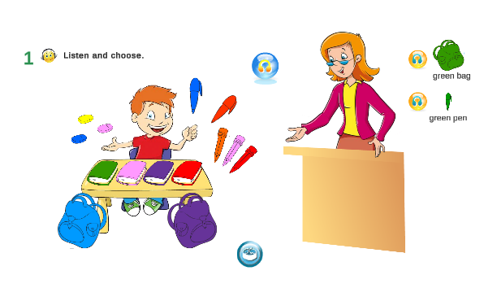

# Language-Exercise-1
This project is an e-learning exercise written in Unity. The exercise will help students to develop their listening skills. The language that will be used is english. 

## Requirements
- Listening exercise
- The student must sellect the object that it was discribed by audio
- A button that plays the audio when clicked
- Multiple objects for the student to chose from
- Animation for positive or negative reenforcement
- After the student has chosen correctly a new button must appear with the image of the object that when clicked plays the audio of the object
- A reset button

## Gallery

